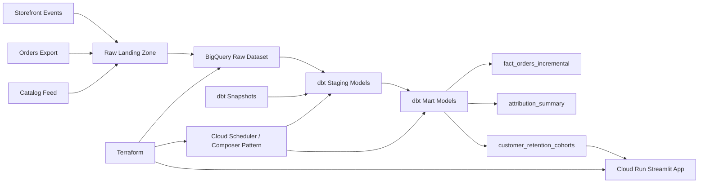

# E-Commerce Analytics Platform

Analytics engineering project centered on governed metric design, attribution, cohort reporting,
and BigQuery/dbt delivery patterns. The goal is to look like a warehouse-owned ecommerce analytics
repo, not a generic dashboard demo.

## What This Project Actually Optimizes For

- Stable KPI definitions for revenue, conversion, refunds, and repeat customer behavior.
- Session-aware attribution outputs that reduce one-off spreadsheet logic from downstream teams.
- Cohort and retention views that belong in curated analytics models, not ad hoc notebooks.
- Incremental warehouse patterns and snapshots that mirror how BigQuery/dbt projects evolve in production.
- A small UI layer that showcases warehouse outputs rather than hiding weak modeling behind charts.

## Analytics Engineering Focus

This repository emphasizes the parts of ecommerce analytics that usually become messy in production:

- orders can be refunded or cancelled after the original booking date,
- marketing teams want attribution cuts that do not match finance's revenue definitions,
- customer retention questions require cohort logic, not just transaction summaries,
- product and customer state can change over time and need snapshotting.

## Architecture



## Why This Feels Senior

- It distinguishes booked order value from realized revenue after refunds.
- It treats attribution and retention as curated modeling problems instead of dashboard calculations.
- It adds snapshot and incremental warehouse patterns because those are common ownership concerns in dbt projects.
- It uses the UI as a thin consumption layer on top of stronger curated models.

## Repository Layout

- `src/ecommerce_analytics_platform/`: Shared Python code, local demo transformations, KPI logic, and config.
- `dbt/`: BigQuery-focused `dbt` project with staging, marts, and snapshots.
- `dags/`: Scheduled orchestration example for refreshing BigQuery and `dbt` assets.
- `infrastructure/terraform/`: Terraform for GCP datasets, bucket, service accounts, Cloud Run, and scheduling.
- `docs/`: Architecture and deployment notes.
- `.github/workflows/`: CI checks.
- `tests/`: Unit tests covering transforms, dashboard payloads, and orchestration helpers.
- `data/sample/raw/`: Sample ecommerce source data for local demo runs.
- `data/demo_output/`: Generated analytics outputs including attribution and retention outputs.

## Implemented Stack Mapping

| Resume technology | Implemented in repo |
| --- | --- |
| GCP | BigQuery datasets, Cloud Storage, service accounts, Cloud Scheduler, and Cloud Run in Terraform |
| BigQuery | Raw-to-analytics dataset design, incremental marts, and job payload generation for scheduled refreshes |
| dbt | Staging, marts, snapshots, and metric-centric SQL models for attribution and retention |
| Analytics Engineering | Revenue governance, refund handling, attribution outputs, and cohort reporting |
| Streamlit | Thin business-facing layer on top of curated KPI, attribution, and retention outputs |

## Quick Start

1. Create a virtual environment and install local tooling:

   ```powershell
   python -m venv .venv
   .\.venv\Scripts\Activate.ps1
   pip install -e .[dev]
   ```

2. Copy environment variables:

   ```powershell
   Copy-Item .env.example .env
   ```

3. Run local validation:

   ```powershell
   python -m pytest
   python -m ruff check . --no-cache
   ```

4. Generate demo outputs and open the revenue signal studio:

   ```powershell
   scripts/run_revenue_signal_studio.ps1
   ```

5. Review GCP deployment inputs:

   ```powershell
   Copy-Item infrastructure/terraform/terraform.tfvars.example infrastructure/terraform/terraform.tfvars
   ```

## Demo Run

If you want a fast local walkthrough without live GCP services:

```powershell
python -m ecommerce_analytics_platform.demo_pipeline
```

This writes generated outputs under `data/demo_output/`:

- `stage/customers.json`, `stage/products.json`, `stage/orders.json`, `stage/sessions.json`
- `mart/dim_customer.json`, `mart/dim_product.json`, `mart/fact_orders.json`, `mart/kpi_daily_overview.json`
- `mart/attribution_summary.json`, `mart/customer_retention.json`
- `quality/quality_results.json`

The Streamlit studio automatically reads those files when present.

## Local Development Notes

- Python 3.11+ is the local development baseline.
- The local pipeline mirrors the logic embodied in the `dbt` models so the repo stays demo-friendly.
- The marts intentionally distinguish booked order value from realized value after refunds.
- Attribution and cohort outputs are treated as governed warehouse assets rather than dashboard-only calculations.
- The orchestration assets generate BigQuery and `dbt` invocation payloads with a configurable dry-run mode.
- The sample pipeline simulates ecommerce operational exports with bundled JSON inputs, which keeps the project interview-ready.

## Verification

- Unit tests cover config parsing, staging transforms, attribution/cohort mart calculations, dashboard shaping, and orchestration payloads.
- CI runs Python validation on every push and pull request.

## Deployment

See [Architecture Notes](docs/architecture.md) and [Deployment Guide](docs/deployment.md) for platform notes and Terraform deployment steps.
