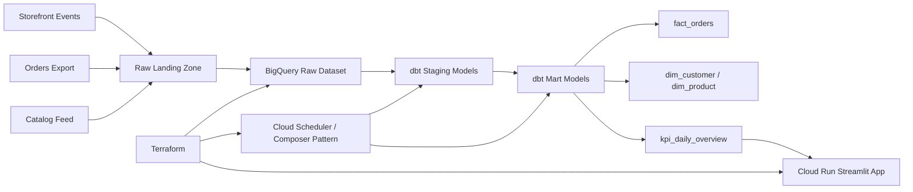

# E-Commerce Analytics Platform

Recruiter-ready ecommerce analytics project built around the stack described in the resume entry:
GCP, BigQuery, dbt, and Streamlit.

## What This Project Demonstrates

- GCP-centered ecommerce analytics platform with raw, staged, and mart data layers for customer and product intelligence.
- BigQuery-ready dimensional modeling for order, session, and catalog performance analytics.
- `dbt` staging and mart models that centralize metric logic and reduce fragmented downstream analysis.
- Scheduled refresh orchestration patterns for dependable KPI publication and governed analytics datasets.
- Streamlit dashboard for business stakeholders to self-serve revenue, conversion, retention, and product performance trends.
- Terraform-managed GCP infrastructure for BigQuery, Cloud Storage, service accounts, scheduling, and Cloud Run hosting.
- GitHub Actions CI validating repository health and Python assets.
- Runnable local demo flow that produces curated analytics extracts and quality outputs without live cloud dependencies.

## Architecture



## Repository Layout

- `src/ecommerce_analytics_platform/`: Shared Python code, local demo transformations, KPI logic, and config.
- `dbt/`: BigQuery-focused `dbt` project with staging and mart models.
- `dags/`: Scheduled orchestration example for refreshing BigQuery and `dbt` assets.
- `infrastructure/terraform/`: Terraform for GCP datasets, bucket, service accounts, Cloud Run, and scheduling.
- `docs/`: Architecture and deployment notes.
- `.github/workflows/`: CI checks.
- `tests/`: Unit tests covering transforms, dashboard payloads, and orchestration helpers.
- `data/sample/raw/`: Sample ecommerce source data for local demo runs.
- `data/demo_output/`: Generated analytics outputs after running the demo pipeline.

## Implemented Stack Mapping

| Resume technology | Implemented in repo |
| --- | --- |
| GCP | BigQuery datasets, Cloud Storage, service accounts, Cloud Scheduler, and Cloud Run in Terraform |
| BigQuery | Raw-to-analytics dataset design, SQL marts, and job payload generation for scheduled refreshes |
| dbt | Staging and mart models for customers, products, orders, and KPI reporting |
| Streamlit | Business-facing dashboard for revenue, AOV, conversion, retention, and product trends |

## Quick Start

1. Create a virtual environment and install local tooling:

   ```powershell
   python -m venv .venv
   .\.venv\Scripts\Activate.ps1
   pip install -e .[dev]
   ```

2. Copy environment variables:

   ```powershell
   Copy-Item .env.example .env
   ```

3. Run local validation:

   ```powershell
   python -m pytest
   python -m ruff check . --no-cache
   ```

4. Generate demo outputs and open the dashboard:

   ```powershell
   python -m ecommerce_analytics_platform.demo_pipeline
   streamlit run streamlit_app.py
   ```

5. Review GCP deployment inputs:

   ```powershell
   Copy-Item infrastructure/terraform/terraform.tfvars.example infrastructure/terraform/terraform.tfvars
   ```

## Demo Run

If you want a fast local walkthrough without live GCP services:

```powershell
python -m ecommerce_analytics_platform.demo_pipeline
```

This writes generated outputs under `data/demo_output/`:

- `stage/customers.json`, `stage/products.json`, `stage/orders.json`, `stage/sessions.json`
- `mart/dim_customer.json`, `mart/dim_product.json`, `mart/fact_orders.json`, `mart/kpi_daily_overview.json`
- `quality/quality_results.json`

The Streamlit app automatically reads those files when present.

## Local Development Notes

- Python 3.11+ is the local development baseline.
- The local pipeline mirrors the logic embodied in the `dbt` models so the repo stays demo-friendly.
- The orchestration assets generate BigQuery and `dbt` invocation payloads with a configurable dry-run mode.
- The sample pipeline simulates ecommerce operational exports with bundled JSON inputs, which keeps the project interview-ready.

## Verification

- Unit tests cover config parsing, staging transforms, mart calculations, dashboard shaping, and orchestration payloads.
- CI runs Python validation on every push and pull request.

## Deployment

See [Architecture Notes](docs/architecture.md) and [Deployment Guide](docs/deployment.md) for platform notes and Terraform deployment steps.
